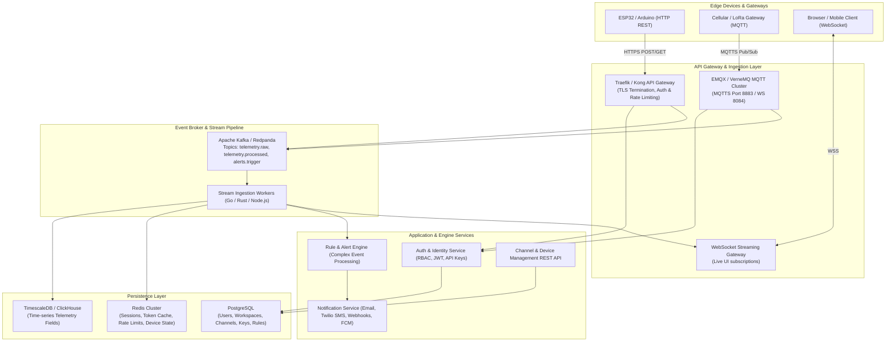
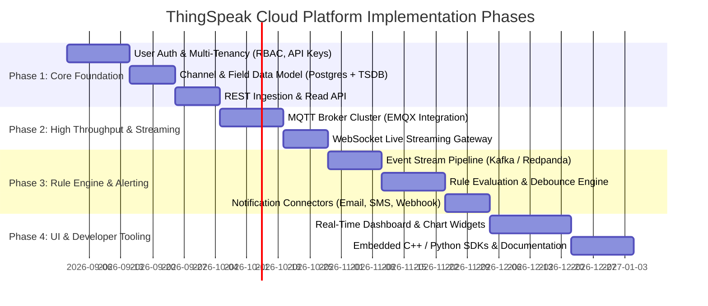

# Product Requirement Document (PRD): ThingSpeak Cloud IoT Platform (SaaS)

**Document Version:** 1.0.0  
**Status:** Draft / Active Review  
**Target Platform:** Multi-tenant Enterprise & Developer IoT Cloud Platform  
**Target Architecture:** Microservices / Distributed Event-Driven (MQTT, REST, WebSockets)

---

## 1. Executive Summary & Vision

### 1.1 Product Overview
The **ThingSpeak Cloud Platform** is an enterprise-grade, multi-tenant IoT cloud data aggregation, visualization, and alerting platform. It enables hardware engineers, IoT developers, and enterprises to connect embedded edge devices (ESP32, STM32, Arduino, Raspberry Pi, Cellular/LoRaWAN Gateways), stream real-time telemetry into isolated **Channels**, monitor real-time dashboards, run analytics, and trigger automated reactions via a robust **Rule Engine**.

### 1.2 Core Value Propositions
- **Frictionless Ingestion:** Zero-setup ingestion via simple REST HTTP GET/POST queries and high-throughput MQTT broker connections.
- **Enterprise Multi-Tenancy & Security:** Granular Role-Based Access Control (RBAC), team workspaces, scoping per channel, and isolated Read/Write API key lifecycles.
- **Flexible Real-time Rule Engine:** Complex threshold evaluation, time-window debouncing, multi-condition triggers, and multi-channel dispatch (Email, SMS, Webhooks, Push Notifications).
- **Scalability & Reliability:** Capable of ingesting tens of thousands of telemetry events per second with sub-100ms processing latencies.

---

## 2. User Personas & Target Audience

| Persona | Role | Key Needs & Pain Points |
| :--- | :--- | :--- |
| **Embedded Developer (Alex)** | Firmware Engineer (ESP32 / C++) | Needs deterministic HTTP/MQTT APIs, C/C++ & Python SDKs, clear payload formats, and instant debug logs to verify device connectivity. |
| **IoT Solutions Architect (Priya)** | Enterprise Technical Lead | Needs multi-tenancy, team collaboration, workspace segregation, rate-limit policies, fine-grained RBAC, and audit logs. |
| **Operations / Field Tech (Marcus)** | Facility & Field Operations | Needs reliable real-time alerting (SMS/Email/Webhook) when sensor thresholds exceed critical ranges, with customizable snooze/debounce policies. |

---

## 3. High-Level System Architecture & Data Flow



---

## 4. Detailed Specification: Step-by-Step Breakdown

---

### STEP 1: User, Multi-Tenancy & Access Management (RBAC)

#### 1.1 Tenant & Workspace Hierarchy
- **Organization (Tenant):** Top-level billing and governance boundary.
- **Workspace:** Isolated environment (e.g., *Production*, *Staging*, *Client-A*). Channels, rules, and devices belong to a Workspace.
- **Users:** Members belonging to an Organization with assigned roles across Workspaces.

```
Organization (e.g., Acme IoT Corp)
 ├── Workspace A: Smart Agriculture
 │    ├── Channels (1..N)
 │    ├── API Keys (Read/Write/Master)
 │    └── Alert Rules
 └── Workspace B: Factory Monitoring
      ├── Channels (1..N)
      └── ...
```

#### 1.2 Role-Based Access Control (RBAC) Matrix

| Role | Manage Billing/Org | Manage Workspaces | Create/Edit Channels & Keys | Write Data (Ingest) | Read Data / Dashboards | Configure Rules/Alerts |
| :--- | :---: | :---: | :---: | :---: | :---: | :---: |
| **Owner** | ✅ | ✅ | ✅ | ✅ | ✅ | ✅ |
| **Admin** | ❌ | ✅ | ✅ | ✅ | ✅ | ✅ |
| **Engineer** | ❌ | ❌ | ✅ | ✅ | ✅ | ✅ |
| **Viewer** | ❌ | ❌ | ❌ | ❌ | ✅ | ❌ |
| **Device (API Key)** | ❌ | ❌ | ❌ | ✅ (Write Key) | ✅ (Read Key) | ❌ |

#### 1.3 API Key Lifecycle & Security Specifications
Each channel automatically generates cryptographically secure, high-entropy tokens:
1. **Write API Key (`api_key`):** Permits appending telemetry data to specific channel fields.
2. **Read API Key:** Permits querying feeds and historical timeseries from private channels.
3. **Workspace Master Key:** Grants scoped access to manage all channels in a workspace programmatically.
4. **Security Specifications:**
   - Keys stored using salted SHA-256 / Argon2 hashes in PostgreSQL.
   - Support for key rotation, expiration timers, and IP whitelisting.
   - Fast token validation cached in Redis (TTL: 5 mins with instant invalidation pub/sub).

#### 1.4 Rate Limiting & Tiered Quotas
Implemented at API Gateway using Redis Token Bucket Algorithm:

| Plan Tier | Max Channels | Ingestion Frequency Limit | Storage Retention | Concurrent MQTT Connections |
| :--- | :--- | :--- | :--- | :--- |
| **Free / Community** | 5 | 1 update / 15 seconds | 30 Days | 2 |
| **Pro / Developer** | 50 | 1 update / 1 second | 1 Year | 50 |
| **Enterprise SaaS** | Unlimited | 10+ updates / second (bursting) | 5 Years + Cold Archive | Dedicated Broker Pool |

---

### STEP 2: Device Communication Protocols & Ingestion

#### 2.1 Protocol 1: RESTful HTTP/HTTPS API

##### Ingestion Endpoints (ThingSpeak-Compatible & Extended)

**1. Update Channel Feed (POST / GET)**
- **Endpoint:** `POST https://api.thingspeakcloud.io/update` or `GET https://api.thingspeakcloud.io/update?api_key=KEY&field1=25.4&field2=60.2`
- **Headers:** `Content-Type: application/x-www-form-urlencoded` or `application/json`
- **Request Body (JSON format):**
```json
{
  "api_key": "WXYZ1234567890AB",
  "created_at": "2026-08-31T14:50:00Z",
  "field1": 24.85,
  "field2": 65.20,
  "field3": 1013.25,
  "field4": 0.042,
  "latitude": 37.7749,
  "longitude": -122.4194,
  "elevation": 15.2,
  "status": "Device OK: Battery 98%"
}
```
- **Success Response (200 OK):**
```json
{
  "success": true,
  "entry_id": 140924,
  "channel_id": 90124,
  "timestamp": "2026-08-31T14:50:00.104Z"
}
```

**2. Query Channel Feed (GET)**
- **Endpoint:** `GET https://api.thingspeakcloud.io/channels/{channel_id}/feeds.json`
- **Query Params:** `api_key=READ_KEY&results=100&start=2026-08-30&average=10`
- **Response:**
```json
{
  "channel": {
    "id": 90124,
    "name": "Environmental Sensor Node #1",
    "field1": "Temperature (°C)",
    "field2": "Humidity (%)",
    "updated_at": "2026-08-31T14:50:00Z"
  },
  "feeds": [
    {
      "created_at": "2026-08-31T14:50:00Z",
      "entry_id": 140924,
      "field1": "24.85",
      "field2": "65.20"
    }
  ]
}
```

---

#### 2.2 Protocol 2: High-Performance MQTT / MQTTS

##### Connection Parameters
- **Broker Host:** `mqtt.thingspeakcloud.io`
- **Ports:** `1883` (Plain MQTT - Local/Dev), `8883` (MQTTS TLS v1.3 - Production), `8084` (WSS for Web)
- **Authentication:**
  - `Username`: Any string or Client ID
  - `Password`: Channel Write API Key or Device Auth Token
  - `Client ID`: Unique hardware identifier (e.g., `ESP32-MAC-4A1B2C`)

##### MQTT Topic Hierarchy

| Action | Topic Format | Description |
| :--- | :--- | :--- |
| **Publish Telemetry** | `channels/<channel_id>/publish` | Ingests JSON or URL-encoded payload to update channel |
| **Publish Single Field**| `channels/<channel_id>/publish/fields/field<N>` | Lightweight payload containing only the raw scalar value |
| **Subscribe to Feed** | `channels/<channel_id>/subscribe/json` | Real-time stream of all incoming updates for that channel |
| **Subscribe to Field**| `channels/<channel_id>/subscribe/fields/field<N>` | Real-time stream of a specific sensor metric |
| **Device Commands** | `channels/<channel_id>/command` | Downlink topic for actuator triggering (Relay on/off, config update) |

##### Sample MQTT Publish Payload:
```json
// Topic: channels/90124/publish
{
  "field1": 28.5,
  "field2": 72.1,
  "status": "PUMP_ON"
}
```

---

#### 2.3 Protocol 3: WebSocket Streaming API
- **Endpoint:** `wss://stream.thingspeakcloud.io/v1/channels/{channel_id}/live?api_key=READ_KEY`
- **Protocol:** JSON message frames over WebSocket.
- **Heartbeat:** `ping` / `pong` every 30s.
- **Use Case:** Zero-latency live updates in web dashboards without polling HTTP.

---

### STEP 3: Alerting, React & Rule Engine Architecture

#### 3.1 Rule Engine Capabilities
The Rule Engine inspects incoming telemetry in real-time as events pass through the stream broker (Apache Kafka / Redis Streams).

```
   [Telemetry Event] 
          │
          ▼
   ┌──────────────────────────────────────────────┐
   │             Rule Condition Evaluator         │
   │  - Expression Parser (e.g., field1 > 75.0)   │
   │  - State Machine (Check previous state)      │
   │  - Debounce / Cooldown Window (e.g., 5 min)  │
   └──────────────────────┬───────────────────────┘
                          │ (Trigger condition met)
                          ▼
   ┌──────────────────────────────────────────────┐
   │            Action Dispatcher Queue           │
   │   ├── Email (SMTP / SendGrid)                │
   │   ├── SMS / WhatsApp (Twilio)                │
   │   ├── Webhook (HTTPS POST + HMAC Signature)  │
   │   └── MQTT Downlink (Actuator Control)       │
   └──────────────────────────────────────────────┘
```

#### 3.2 Rule Schema Specification
```json
{
  "rule_id": "rule_8f93a1c0",
  "workspace_id": "ws_alpha_01",
  "channel_id": 90124,
  "name": "High Temperature Emergency Alert",
  "enabled": true,
  "evaluation": {
    "type": "THRESHOLD",
    "field": "field1",
    "operator": ">=",
    "threshold_value": 75.0,
    "duration_seconds": 60
  },
  "debounce_policy": {
    "mode": "COOLDOWN",
    "cooldown_minutes": 15,
    "alert_on_recovery": true
  },
  "actions": [
    {
      "type": "EMAIL",
      "recipients": ["ops-team@company.com", "duty-engineer@company.com"],
      "subject": "CRITICAL: High Temp on {{channel.name}} ({{field1}}°C)",
      "body_template": "Channel {{channel.id}} exceeded threshold 75°C. Current reading: {{field1}}°C at {{timestamp}}."
    },
    {
      "type": "SMS",
      "provider": "TWILIO",
      "phone_numbers": ["+12025550143"],
      "message": "ALERT: {{channel.name}} Temp {{field1}}C exceeds limit!"
    },
    {
      "type": "WEBHOOK",
      "url": "https://api.pagerduty.com/v2/enqueue",
      "method": "POST",
      "headers": {
        "Authorization": "Token secret_token_here",
        "Content-Type": "application/json"
      },
      "payload_template": {
        "routing_key": "service_key",
        "event_action": "trigger",
        "payload": {
          "summary": "High temp alert on {{channel.name}}",
          "severity": "critical",
          "source": "thingspeak-cloud-engine",
          "custom_details": {
            "temp": "{{field1}}",
            "humidity": "{{field2}}"
          }
        }
      }
    },
    {
      "type": "MQTT_DOWNLINK",
      "topic": "channels/90124/command",
      "payload": "{\"relay_state\": \"OFF\", \"reason\": \"OVERHEAT_PROTECTION\"}"
    }
  ]
}
```

#### 3.3 Rule Types Supported
1. **Threshold & Condition (React):** e.g., `field1 > 40` or `(field1 > 35 AND field2 < 20)`.
2. **TimeControl (Scheduled Events):** Triggering an action at specific cron times or intervals.
3. **No-Data / Heartbeat Watchdog (Dead-Man's Switch):** Alert if a device fails to send data within expected interval (e.g., No ping for 10 minutes).
4. **ThingHTTP / Outbound Webhooks:** Transforming telemetry data and forwarding to third-party endpoints.

---

## 5. Non-Functional Requirements (NFRs) & SLA

| Category | Requirement Specification |
| :--- | :--- |
| **Ingestion Throughput** | Minimum 20,000 requests/sec across API gateway cluster with linear horizontal scaling. |
| **End-to-End Latency** | Ingestion-to-storage < 80ms; Ingestion-to-WebSocket/Alert trigger < 150ms. |
| **Availability (SLA)** | 99.95% uptime for Ingestion and MQTT endpoints. |
| **Data Integrity & Durability** | Write-ahead logging (WAL) on TimescaleDB/Kafka; zero telemetry data loss during service restarts. |
| **Security Compliance** | TLS 1.3 on all endpoints, AES-256 encryption at rest, OWASP Top 10 compliance, API Key salted hashing. |

---

## 6. Phased Implementation Roadmap



---

## 7. Next Steps & Interactive Deep-Dives
The next steps for this PRD are organized into modular deep-dives:
1. **Data Model & Schema DDL:** PostgreSQL & TimescaleDB table schemas, hypertable configurations, and indexing strategies.
2. **Firmware & Client Integration Guides:** Example Arduino/ESP32 C++ and MicroPython code snippets for HTTP & MQTT.
3. **API Swagger / OpenAPI 3.0 Specification:** Complete endpoints, request/response structures, error codes.
4. **Deployment & DevOps Architecture:** Docker Compose / Kubernetes Helm charts for the full stack.
