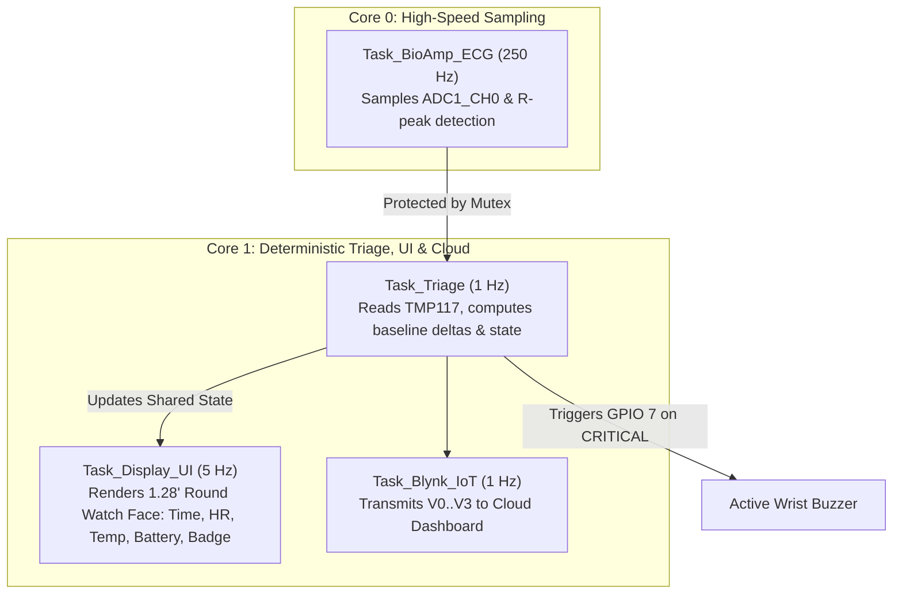

# Product Requirement Document (PRD)
# Personalized Construction Worker Health Watch & Cloud Triage Platform

**Document Version:** 2.1.0  
**Target Hardware:** Waveshare ESP32-S3 Mini, 1.28" Round LCD (GC9A01), BioAmp Candy, TMP117 (7Semi), WLY103443 1600mAh LiPo  
**Cloud Ecosystem:** Open-Source Backend + Blynk IoT Cloud Dashboard  
**Status:** Approved for Implementation  

---

## 1. Executive Summary & Core Value Proposition

### 1.1 Problem Statement
Construction workers perform demanding physical labor under extreme thermal strain. Standard wearable monitors use rigid, universal thresholds that trigger high false-alarm rates or miss heat stroke in vulnerable workers.

### 1.2 The Solution
A ruggedized wearable smart watch prototype featuring a **1.28-inch Round LCD (240x240 circular UI)** and a **3.7V 1600mAh LiPo battery**, continuously monitoring **2 vital physiological parameters**:
1. **Heart Rate & Cardiac Pulse** via **BioAmp Candy** strip.
2. **Skin / Body Temperature** via high-precision **TMP117 (7Semi)**.

### 1.3 Core Novelty: Personalized Health Profiling
Individualized baseline conditioning accounts for worker resting heart rate ($HR_{\text{baseline}}$), resting body temperature ($Temp_{\text{baseline}}$), and age-adjusted physical capacity:
$$\Delta HR = HR_{\text{current}} - HR_{\text{baseline}}, \quad \Delta Temp = Temp_{\text{current}} - Temp_{\text{baseline}}$$

### 1.4 Real-time 3-Tier Health Triage
* **🟢 HEALTHY (Normal):** Green watch theme, silent buzzer, normal dashboard status.
* **🟡 RISK (Warning):** Yellow watch theme, elevated HR or temp warning on dashboard, silent buzzer on watch.
* **🔴 CRITICAL (Emergency):** Red flashing watch theme, **active wrist buzzer sounds continuous alarm**, and Blynk IoT triggers emergency push alerts and flashing indicators.

---

## 2. Complete Hardware & Pin-to-Pin Integration

```
        ┌────────────────────────────────────────────────────────┐
        │            WAVESHARE ESP32-S3 MINI MCU                 │
        │                                                        │
        │  [3V3] ───────────────┬──────────────┬───────────────  │
        │  [GND] ───────────────┼──────────────┼───────────────  │
        │  [GPIO 1] (ADC1_CH0) ─┼── BioAmp Candy (OUT/SIGNAL)    │
        │  [GPIO 2] (ADC1_CH1) ─┼── 1600mAh LiPo Voltage Divider │
        │  [GPIO 4] (I2C SDA) ──┼── TMP117 (SDA)                 │
        │  [GPIO 5] (I2C SCL) ──┼── TMP117 (SCL)                 │
        │  [GPIO 7] (Digital)  ─┼── Active Buzzer (+)            │
        │  [GPIO 8] (SPI DC)   ─┼── 1.28" LCD (DC)               │
        │  [GPIO 9] (SPI CS)   ─┼── 1.28" LCD (CS)               │
        │  [GPIO 10] (SPI SCLK)─┼── 1.28" LCD (SCL / SCLK)       │
        │  [GPIO 11] (SPI MOSI)─┼── 1.28" LCD (SDA / DIN)        │
        │  [GPIO 14] (Reset)   ─┼── 1.28" LCD (RST)              │
        │  [GPIO 15] (PWM)     ─┼── 1.28" LCD (Backlight BL)     │
        └───────────────────────┴────────────────────────────────┘
```

### Pin-by-Pin Wiring Table:

| Subsystem | Component Pin | ESP32-S3 Mini Pin | Description |
| :--- | :--- | :--- | :--- |
| **Power** | LiPo Battery (+) | TP4056 IN+ / VBAT | 3.7V 1600mAh 1S LiPo (`WLY103443`) |
| **Power** | Battery Divider | **GPIO 2 (ADC1_CH1)** | 100k/100k voltage divider for % monitoring |
| **BioAmp Candy** | `OUT` | **GPIO 1 (ADC1_CH0)** | Analog ECG / Pulse Signal |
| **TMP117 (7Semi)** | `SDA` | **GPIO 4** | I2C Data Line (with 4.7kΩ pull-up) |
| **TMP117 (7Semi)** | `SCL` | **GPIO 5** | I2C Clock Line (with 4.7kΩ pull-up) |
| **1.28" Round LCD** | `DC` | **GPIO 8** | Data/Command selector |
| **1.28" Round LCD** | `CS` | **GPIO 9** | SPI Chip Select |
| **1.28" Round LCD** | `SCL` / `SCLK` | **GPIO 10** | SPI Clock |
| **1.28" Round LCD** | `SDA` / `MOSI` | **GPIO 11** | SPI Master Out Slave In |
| **1.28" Round LCD** | `RST` | **GPIO 14** | Display Hardware Reset |
| **1.28" Round LCD** | `BLK` / `BL` | **GPIO 15** | Backlight LED Brightness Control |
| **Active Buzzer** | `(+) Anode` | **GPIO 7** | Alarm trigger (**CRITICAL** only) |

---

## 3. FreeRTOS Watch Multi-Tasking Architecture



---

## 4. 1.28-inch Round Watch UI Layout (240 x 240 px)

1. **Outer Ambient Ring:** Color-coded dynamic boundary (🟢 Green: Normal, 🟡 Yellow: Warning, 🔴 Flashing Red: Critical).
2. **Top Header:** Real-time Digital Clock (`HH:MM:SS` synced via NTP) + Battery Percentage (`%`).
3. **Center Left Card:** Live Heart Rate in BPM with label.
4. **Center Right Card:** Live Body / Skin Temperature in °C with label.
5. **Bottom Banner:** Rounded health state badge (`HEALTHY`, `RISK WARN`, `! CRITICAL !`).

---

## 5. Blynk IoT Virtual Pin Map

| Virtual Pin | Widget | Data Stream | Description |
| :---: | :---: | :---: | :--- |
| **V0** | Gauge | Heart Rate (`BPM`) | Instantaneous heart rate |
| **V1** | Gauge | Body Temp (`°C`) | Real-time body temperature |
| **V2** | Label | Health Status Text | `🟢 HEALTHY` / `🟡 RISK` / `🔴 CRITICAL` |
| **V3** | LED | Emergency Light | `0` = Off, `255` = Flashing Red on Critical |
| **V5** | Slider | Baseline HR Config | Personalized resting HR input per worker |
| **V6** | Slider | Baseline Temp Config | Personalized resting Temp input per worker |
